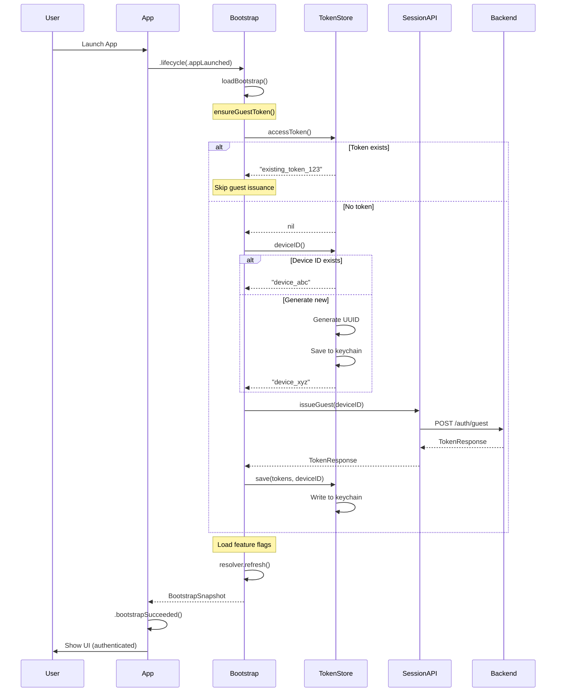

## State Machine

```
┌─────────────┐
│ App Launch  │
└──────┬──────┘
       │
       v
┌─────────────────┐
│ Check Keychain  │
└──────┬──────────┘
       │
       ├─── Token exists ───┐
       │                    │
       └─── No token        │
              │             │
              v             │
       ┌──────────────┐     │
       │ Get/Generate │     │
       │  Device ID   │     │
       └──────┬───────┘     │
              │             │
              v             │
       ┌──────────────┐     │
       │ Call Backend │     │
       │ /auth/guest  │     │
       └──────┬───────┘     │
              │             │
              v             │
       ┌──────────────┐     │
       │ Save Token   │     │
       │ to Keychain  │     │
       └──────┬───────┘     │
              │             │
              v             v
       ┌──────────────────────┐
       │ Load Feature Flags   │
       └──────────┬───────────┘
                  │
                  v
       ┌──────────────────────┐
       │ Bootstrap Complete   │
       │ App Ready            │
       └──────────────────────┘
```
