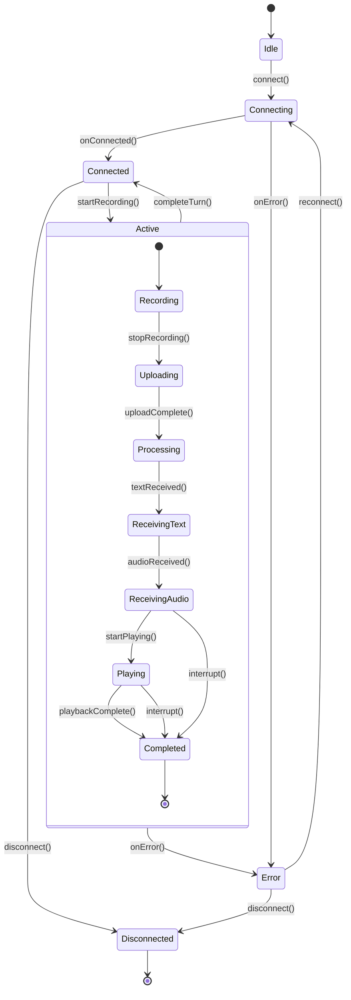

# 会话与对话状态机设计

**日期**: 2026-09-21  
**目标**: 定义会话（Session）和对话轮次（Turn）的状态机，确保状态转换的合法性

---

## 一、状态机概述

### 1.1 双层状态模型

系统采用**双层状态机**设计：

1. **会话状态机**（Session State Machine）
   - 管理 WebSocket 连接生命周期
   - 作用域：整个会话
   - 状态数：6 个

2. **对话轮次状态机**（Turn State Machine）
   - 管理单次对话的录音 → 识别 → 合成 → 播放流程
   - 作用域：单个 turn_id
   - 状态数：7 个

### 1.2 状态机层次关系

```
SessionState (会话层)
    │
    ├─ idle: 未连接
    ├─ connecting: 连接中
    ├─ connected: 已连接，空闲
    ├─ active(turnID): 活跃对话中
    │      │
    │      └─ TurnState (对话层)
    │           ├─ recording: 录音中
    │           ├─ uploading: 上传音频中
    │           ├─ processing: 等待服务端处理
    │           ├─ receivingText: 接收文本流
    │           ├─ receivingAudio: 接收音频流
    │           ├─ playing: 播放中
    │           └─ completed: 本轮完成
    │
    ├─ error(Error): 错误状态
    └─ disconnected: 已断开
```

---

## 二、会话状态机（Session State Machine）

### 2.1 状态定义

```swift
enum SessionState: Equatable {
    case idle
    case connecting
    case connected
    case active(turnID: String, turnState: TurnState)
    case error(SessionError)
    case disconnected
    
    static func == (lhs: SessionState, rhs: SessionState) -> Bool {
        switch (lhs, rhs) {
        case (.idle, .idle),
             (.connecting, .connecting),
             (.connected, .connected),
             (.disconnected, .disconnected):
            return true
        case let (.active(lhsTurnID, lhsTurnState), .active(rhsTurnID, rhsTurnState)):
            return lhsTurnID == rhsTurnID && lhsTurnState == rhsTurnState
        case let (.error(lhsError), .error(rhsError)):
            return lhsError.localizedDescription == rhsError.localizedDescription
        default:
            return false
        }
    }
}

enum SessionError: Error {
    case connectionFailed(Error)
    case authenticationFailed
    case protocolError(String)
    case timeout
    case serverError(ErrorData)
}
```

### 2.2 状态转换表

| 当前状态 | 事件 | 目标状态 | 副作用 |
|---------|------|---------|--------|
| idle | connect() | connecting | 建立 WebSocket 连接 |
| connecting | connected | connected | 发送 session.start |
| connecting | error | error | - |
| connected | startRecording() | active(recording) | 生成 turn_id，开始录音 |
| connected | disconnect() | disconnected | 关闭连接 |
| active | turnCompleted | connected | 清理 turn 状态 |
| active | error | error | 停止录音/播放 |
| error | reconnect() | connecting | - |
| error | disconnect() | disconnected | - |
| * | forceDisconnect() | disconnected | 强制清理 |

### 2.3 状态转换实现

```swift
actor SessionStateManager {
    private(set) var currentState: SessionState = .idle
    private var stateHistory: [SessionState] = []
    
    // 状态转换
    func transition(to newState: SessionState, event: String) throws {
        let oldState = currentState
        
        // 验证转换合法性
        guard isValidTransition(from: oldState, to: newState) else {
            throw StateTransitionError.illegalTransition(
                from: oldState,
                to: newState,
                event: event
            )
        }
        
        // 记录历史
        stateHistory.append(oldState)
        if stateHistory.count > 100 {
            stateHistory.removeFirst()
        }
        
        // 执行转换
        currentState = newState
        
        print("🔄 Session state: \(oldState) → \(newState) [\(event)]")
    }
    
    // 验证转换合法性
    private func isValidTransition(
        from: SessionState,
        to: SessionState
    ) -> Bool {
        switch (from, to) {
        case (.idle, .connecting):
            return true
            
        case (.connecting, .connected),
             (.connecting, .error):
            return true
            
        case (.connected, .active),
             (.connected, .disconnected):
            return true
            
        case (.active, .connected),
             (.active, .error):
            return true
            
        case (.error, .connecting),
             (.error, .disconnected):
            return true
            
        case (_, .disconnected):
            // 任何状态都可以强制断开
            return true
            
        default:
            return false
        }
    }
    
    // 获取当前 Turn ID
    func currentTurnID() -> String? {
        if case .active(let turnID, _) = currentState {
            return turnID
        }
        return nil
    }
    
    // 检查是否可以开始新对话
    func canStartNewTurn() -> Bool {
        switch currentState {
        case .connected:
            return true
        default:
            return false
        }
    }
}

enum StateTransitionError: Error {
    case illegalTransition(from: SessionState, to: SessionState, event: String)
}
```

---

## 三、对话轮次状态机（Turn State Machine）

### 3.1 状态定义

```swift
enum TurnState: Equatable {
    case recording
    case uploading(progress: Double)
    case processing
    case receivingText
    case receivingAudio(receivedFrames: Int)
    case playing(progress: Double)
    case completed
    
    static func == (lhs: TurnState, rhs: TurnState) -> Bool {
        switch (lhs, rhs) {
        case (.recording, .recording),
             (.processing, .processing),
             (.receivingText, .receivingText),
             (.completed, .completed):
            return true
        case let (.uploading(lhsProg), .uploading(rhsProg)),
             let (.playing(lhsProg), .playing(rhsProg)):
            return abs(lhsProg - rhsProg) < 0.01
        case let (.receivingAudio(lhsFrames), .receivingAudio(rhsFrames)):
            return lhsFrames == rhsFrames
        default:
            return false
        }
    }
}
```

### 3.2 状态转换表

| 当前状态 | 事件 | 目标状态 | 副作用 |
|---------|------|---------|--------|
| - | startRecording() | recording | 开始音频采集 |
| recording | stopRecording() | uploading | 发送 turn.end |
| uploading | uploadComplete | processing | 等待服务端 |
| processing | textReceived | receivingText | 显示文本流 |
| receivingText | audioReceived | receivingAudio | 开始缓冲音频 |
| receivingAudio | startPlaying | playing | 播放音频队列 |
| playing | playbackComplete | completed | - |
| receivingAudio | turnEnd | completed | 文本先完成 |
| * | interrupt() | completed | 打断当前对话 |
| * | error | (session.error) | 提升到会话层 |

### 3.3 状态转换实现

```swift
actor TurnStateManager {
    private(set) var currentState: TurnState = .recording
    private var stateHistory: [TurnState] = []
    
    func transition(to newState: TurnState, event: String) throws {
        let oldState = currentState
        
        guard isValidTransition(from: oldState, to: newState) else {
            throw StateTransitionError.illegalTransition(
                from: SessionState.active(turnID: "", turnState: oldState),
                to: SessionState.active(turnID: "", turnState: newState),
                event: event
            )
        }
        
        stateHistory.append(oldState)
        if stateHistory.count > 50 {
            stateHistory.removeFirst()
        }
        
        currentState = newState
        
        print("  🔄 Turn state: \(oldState) → \(newState) [\(event)]")
    }
    
    private func isValidTransition(
        from: TurnState,
        to: TurnState
    ) -> Bool {
        switch (from, to) {
        case (.recording, .uploading):
            return true
            
        case (.uploading, .processing):
            return true
            
        case (.processing, .receivingText),
             (.processing, .receivingAudio):
            return true
            
        case (.receivingText, .receivingAudio):
            return true
            
        case (.receivingAudio, .playing),
             (.receivingAudio, .completed):
            return true
            
        case (.playing, .completed):
            return true
            
        case (_, .completed):
            // 任何状态都可以被打断或错误
            return true
            
        default:
            return false
        }
    }
    
    // 检查是否可以打断
    func canInterrupt() -> Bool {
        switch currentState {
        case .playing, .receivingAudio:
            return true
        default:
            return false
        }
    }
}
```

---

## 四、状态机集成

### 4.1 统一状态管理器

```swift
actor VoiceSessionStateMachine {
    private let sessionManager: SessionStateManager
    private var turnManagers: [String: TurnStateManager] = [:]
    
    init() {
        self.sessionManager = SessionStateManager()
    }
    
    // MARK: - Session Operations
    
    func connect() async throws {
        try await sessionManager.transition(to: .connecting, event: "connect")
        // ... 执行连接逻辑
    }
    
    func onConnected() async throws {
        try await sessionManager.transition(to: .connected, event: "onConnected")
    }
    
    func disconnect() async throws {
        // 清理所有 turn
        turnManagers.removeAll()
        try await sessionManager.transition(to: .disconnected, event: "disconnect")
    }
    
    // MARK: - Turn Operations
    
    func startRecording() async throws -> String {
        guard await sessionManager.canStartNewTurn() else {
            throw VoiceSessionError.cannotStartTurn(
                reason: "Session not ready",
                currentState: await sessionManager.currentState
            )
        }
        
        let turnID = UUID().uuidString
        let turnManager = TurnStateManager()
        turnManagers[turnID] = turnManager
        
        try await turnManager.transition(to: .recording, event: "startRecording")
        try await sessionManager.transition(
            to: .active(turnID: turnID, turnState: .recording),
            event: "startRecording"
        )
        
        return turnID
    }
    
    func stopRecording(turnID: String) async throws {
        guard let turnManager = turnManagers[turnID] else {
            throw VoiceSessionError.turnNotFound(turnID)
        }
        
        try await turnManager.transition(to: .uploading(progress: 0), event: "stopRecording")
        try await updateSessionState(turnID: turnID)
    }
    
    func onTextReceived(turnID: String) async throws {
        guard let turnManager = turnManagers[turnID] else { return }
        
        try await turnManager.transition(to: .receivingText, event: "textReceived")
        try await updateSessionState(turnID: turnID)
    }
    
    func onAudioReceived(turnID: String, frameCount: Int) async throws {
        guard let turnManager = turnManagers[turnID] else { return }
        
        try await turnManager.transition(
            to: .receivingAudio(receivedFrames: frameCount),
            event: "audioReceived"
        )
        try await updateSessionState(turnID: turnID)
    }
    
    func startPlaying(turnID: String) async throws {
        guard let turnManager = turnManagers[turnID] else { return }
        
        try await turnManager.transition(to: .playing(progress: 0), event: "startPlaying")
        try await updateSessionState(turnID: turnID)
    }
    
    func completeTurn(turnID: String) async throws {
        guard let turnManager = turnManagers[turnID] else { return }
        
        try await turnManager.transition(to: .completed, event: "completeTurn")
        turnManagers.removeValue(forKey: turnID)
        
        try await sessionManager.transition(to: .connected, event: "turnCompleted")
    }
    
    func interrupt(turnID: String) async throws {
        guard let turnManager = turnManagers[turnID],
              await turnManager.canInterrupt() else {
            return
        }
        
        try await turnManager.transition(to: .completed, event: "interrupt")
        turnManagers.removeValue(forKey: turnID)
        
        try await sessionManager.transition(to: .connected, event: "interrupted")
    }
    
    // MARK: - Error Handling
    
    func onError(_ error: SessionError) async throws {
        // 清理所有 turn
        turnManagers.removeAll()
        
        try await sessionManager.transition(to: .error(error), event: "error")
    }
    
    // MARK: - State Queries
    
    func currentState() async -> SessionState {
        await sessionManager.currentState
    }
    
    func currentTurnState(turnID: String) async -> TurnState? {
        await turnManagers[turnID]?.currentState
    }
    
    // MARK: - Private Helpers
    
    private func updateSessionState(turnID: String) async throws {
        guard let turnManager = turnManagers[turnID] else { return }
        
        let turnState = await turnManager.currentState
        try await sessionManager.transition(
            to: .active(turnID: turnID, turnState: turnState),
            event: "turnStateChanged"
        )
    }
}

enum VoiceSessionError: Error {
    case cannotStartTurn(reason: String, currentState: SessionState)
    case turnNotFound(String)
    case invalidOperation(String)
}
```

### 4.2 状态观察者

```swift
actor StateObserver {
    private var observers: [UUID: (SessionState) async -> Void] = [:]
    
    func addObserver(_ callback: @escaping (SessionState) async -> Void) -> UUID {
        let id = UUID()
        observers[id] = callback
        return id
    }
    
    func removeObserver(_ id: UUID) {
        observers.removeValue(forKey: id)
    }
    
    func notify(state: SessionState) async {
        for (_, callback) in observers {
            await callback(state)
        }
    }
}

// 使用示例
let stateMachine = VoiceSessionStateMachine()
let observer = StateObserver()

let observerID = await observer.addObserver { state in
    print("State changed to: \(state)")
    
    // 更新 UI
    await MainActor.run {
        self.updateUI(for: state)
    }
}
```

---

## 五、状态转换场景

### 5.1 正常对话流程

```
1. 用户启动应用
   idle → connecting → connected

2. 用户按住说话按钮
   connected → active(turn_001, recording)

3. 用户说话中
   active(turn_001, recording) (状态保持)

4. 用户松开按钮
   active(turn_001, recording) → active(turn_001, uploading)

5. 上传完成
   active(turn_001, uploading) → active(turn_001, processing)

6. 服务端开始返回文本
   active(turn_001, processing) → active(turn_001, receivingText)

7. 服务端开始返回音频
   active(turn_001, receivingText) → active(turn_001, receivingAudio)

8. 音频缓冲足够，开始播放
   active(turn_001, receivingAudio) → active(turn_001, playing)

9. 播放完成
   active(turn_001, playing) → active(turn_001, completed) → connected

10. 准备下一轮对话
    connected (等待用户操作)
```

### 5.2 打断场景

```
场景：AI 正在说话，用户打断

1. 当前状态
   active(turn_001, playing)

2. 用户按住说话按钮（打断）
   active(turn_001, playing) → active(turn_001, completed) → connected
   connected → active(turn_002, recording)

3. 继续正常流程
   ...
```

### 5.3 错误场景

```
场景：网络断开

1. 当前状态
   active(turn_001, uploading)

2. 网络错误
   active(turn_001, uploading) → error(connectionFailed)

3. 自动重连
   error(connectionFailed) → connecting → connected

4. 恢复后用户可以开始新对话
   connected → active(turn_002, recording)
```

---

## 六、状态持久化

### 6.1 状态快照

```swift
struct SessionStateSnapshot: Codable {
    let sessionID: String
    let state: String  // 序列化后的状态
    let timestamp: Date
    let turnID: String?
    let turnState: String?
}

actor StatePersistence {
    func save(snapshot: SessionStateSnapshot) async {
        let encoder = JSONEncoder()
        guard let data = try? encoder.encode(snapshot) else { return }
        
        UserDefaults.standard.set(data, forKey: "last_session_state")
    }
    
    func restore() async -> SessionStateSnapshot? {
        guard let data = UserDefaults.standard.data(forKey: "last_session_state") else {
            return nil
        }
        
        let decoder = JSONDecoder()
        return try? decoder.decode(SessionStateSnapshot.self, from: data)
    }
}
```

### 6.2 崩溃恢复

```swift
actor CrashRecoveryManager {
    private let persistence: StatePersistence
    private let stateMachine: VoiceSessionStateMachine
    
    init(persistence: StatePersistence, stateMachine: VoiceSessionStateMachine) {
        self.persistence = persistence
        self.stateMachine = stateMachine
    }
    
    func attemptRecovery() async {
        guard let snapshot = await persistence.restore() else {
            return
        }
        
        // 检查时间戳（超过 1 小时不恢复）
        guard Date().timeIntervalSince(snapshot.timestamp) < 3600 else {
            return
        }
        
        // 尝试重连
        do {
            try await stateMachine.connect()
            print("✅ Recovered from crash")
        } catch {
            print("❌ Recovery failed: \(error)")
        }
    }
}
```

---

## 七、状态机测试

### 7.1 单元测试

```swift
class SessionStateManagerTests: XCTestCase {
    var manager: SessionStateManager!
    
    override func setUp() async throws {
        manager = SessionStateManager()
    }
    
    func testValidTransitions() async throws {
        // idle → connecting
        try await manager.transition(to: .connecting, event: "test")
        let state1 = await manager.currentState
        XCTAssertEqual(state1, .connecting)
        
        // connecting → connected
        try await manager.transition(to: .connected, event: "test")
        let state2 = await manager.currentState
        XCTAssertEqual(state2, .connected)
        
        // connected → active
        try await manager.transition(
            to: .active(turnID: "test", turnState: .recording),
            event: "test"
        )
        let state3 = await manager.currentState
        if case .active(let turnID, _) = state3 {
            XCTAssertEqual(turnID, "test")
        } else {
            XCTFail("Expected active state")
        }
    }
    
    func testIllegalTransition() async {
        // idle → connected (跳过 connecting)
        do {
            try await manager.transition(to: .connected, event: "test")
            XCTFail("Should throw error")
        } catch {
            XCTAssertTrue(error is StateTransitionError)
        }
    }
    
    func testForceDisconnect() async throws {
        // 任何状态都可以强制断开
        try await manager.transition(to: .connecting, event: "test")
        try await manager.transition(to: .disconnected, event: "force")
        
        let state = await manager.currentState
        XCTAssertEqual(state, .disconnected)
    }
}
```

### 7.2 集成测试

```swift
class VoiceSessionStateMachineTests: XCTestCase {
    var stateMachine: VoiceSessionStateMachine!
    
    override func setUp() async throws {
        stateMachine = VoiceSessionStateMachine()
    }
    
    func testFullConversationFlow() async throws {
        // 1. 连接
        try await stateMachine.connect()
        try await stateMachine.onConnected()
        
        var state = await stateMachine.currentState()
        XCTAssertEqual(state, .connected)
        
        // 2. 开始录音
        let turnID = try await stateMachine.startRecording()
        state = await stateMachine.currentState()
        
        if case .active(let id, .recording) = state {
            XCTAssertEqual(id, turnID)
        } else {
            XCTFail("Expected active(recording)")
        }
        
        // 3. 停止录音
        try await stateMachine.stopRecording(turnID: turnID)
        
        // 4. 接收文本
        try await stateMachine.onTextReceived(turnID: turnID)
        
        // 5. 接收音频
        try await stateMachine.onAudioReceived(turnID: turnID, frameCount: 10)
        
        // 6. 开始播放
        try await stateMachine.startPlaying(turnID: turnID)
        
        // 7. 完成
        try await stateMachine.completeTurn(turnID: turnID)
        
        state = await stateMachine.currentState()
        XCTAssertEqual(state, .connected)
    }
    
    func testInterruption() async throws {
        try await stateMachine.connect()
        try await stateMachine.onConnected()
        
        // 开始第一轮对话
        let turn1 = try await stateMachine.startRecording()
        try await stateMachine.stopRecording(turnID: turn1)
        try await stateMachine.startPlaying(turnID: turn1)
        
        // 打断
        try await stateMachine.interrupt(turnID: turn1)
        
        let state = await stateMachine.currentState()
        XCTAssertEqual(state, .connected)
        
        // 可以开始新对话
        let turn2 = try await stateMachine.startRecording()
        XCTAssertNotEqual(turn1, turn2)
    }
}
```

---

## 八、状态机可视化

### 8.1 Mermaid 图表



### 8.2 状态转换日志

```swift
actor StateLogger {
    private var logs: [StateTransitionLog] = []
    
    struct StateTransitionLog {
        let timestamp: Date
        let from: String
        let to: String
        let event: String
        let turnID: String?
    }
    
    func log(from: SessionState, to: SessionState, event: String) {
        let log = StateTransitionLog(
            timestamp: Date(),
            from: "\(from)",
            to: "\(to)",
            event: event,
            turnID: extractTurnID(from: to)
        )
        
        logs.append(log)
        
        // 保留最近 1000 条
        if logs.count > 1000 {
            logs.removeFirst()
        }
        
        print("📊 [\(log.timestamp)] \(log.from) → \(log.to) [\(log.event)]")
    }
    
    func exportLogs() -> String {
        logs.map { log in
            "\(log.timestamp): \(log.from) → \(log.to) [\(log.event)]"
        }.joined(separator: "\n")
    }
    
    private func extractTurnID(from state: SessionState) -> String? {
        if case .active(let turnID, _) = state {
            return turnID
        }
        return nil
    }
}
```

---

## 九、最佳实践

### 9.1 状态机设计原则

1. **显式优于隐式**: 所有状态显式定义，不用布尔标志组合
2. **非法状态不可表达**: 用类型系统阻止非法状态
3. **转换规则集中**: 所有转换逻辑在 `isValidTransition` 中
4. **副作用分离**: 状态转换只负责状态，副作用由调用方处理
5. **可测试**: 状态机独立于业务逻辑，易于单元测试

### 9.2 常见陷阱

❌ **陷阱 1: 用布尔标志表示状态**

```swift
// 错误
var isConnected: Bool
var isRecording: Bool
var isPlaying: Bool

// 问题：可以同时 isRecording && isPlaying，非法状态
```

✅ **正确做法: 用枚举**

```swift
enum SessionState {
    case idle
    case connected
    case recording
    case playing
}

// 不可能同时处于多个状态
```

❌ **陷阱 2: 状态转换逻辑分散**

```swift
// 错误：转换逻辑散落在各处
func startRecording() {
    if state == .connected {
        state = .recording
    }
}

func onError() {
    state = .error  // 忘记检查当前状态
}
```

✅ **正确做法: 集中验证**

```swift
func transition(to newState: State) throws {
    guard isValidTransition(from: currentState, to: newState) else {
        throw InvalidTransition()
    }
    currentState = newState
}
```

---

## 十、总结

### 关键设计点

1. **双层状态机**: Session + Turn，层次清晰
2. **编译时安全**: 枚举 + 关联值，类型安全
3. **转换验证**: 非法转换抛出错误，防止进入脏状态
4. **状态历史**: 记录转换历史，便于调试
5. **Actor 隔离**: 状态机本身是 actor，线程安全

### 状态机特性

- ✅ 6 个会话状态 + 7 个对话状态
- ✅ 转换规则表清晰定义
- ✅ 支持打断、错误恢复
- ✅ 状态持久化与崩溃恢复
- ✅ 完整的单元测试覆盖

### 与 Backend 对照

| Backend (Go) | iOS (Swift) |
|-------------|-------------|
| Turn 状态机 (6 状态) | TurnState 枚举 (7 状态) |
| 状态转换表 | isValidTransition() |
| sync.Mutex 保护 | Actor 自动隔离 |
| 状态回调 | AsyncStream 事件流 |

下一步: [06_error_handling.md](06_error_handling.md) - 错误处理与降级策略
