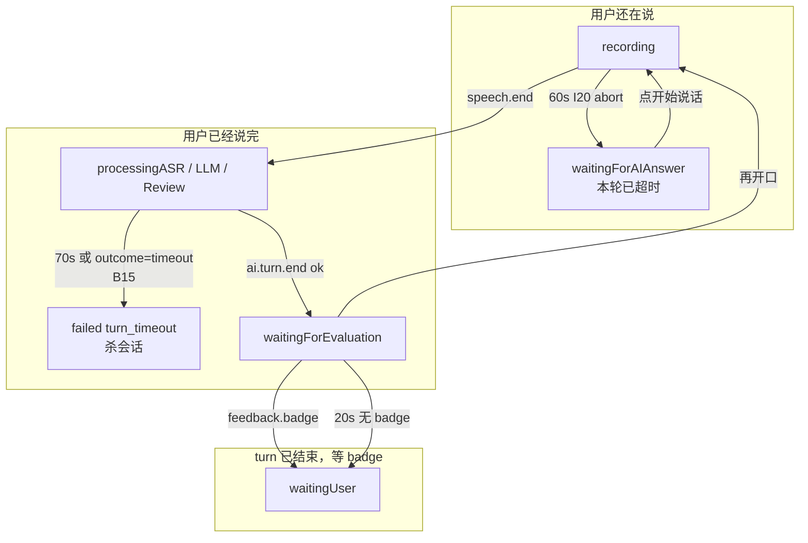
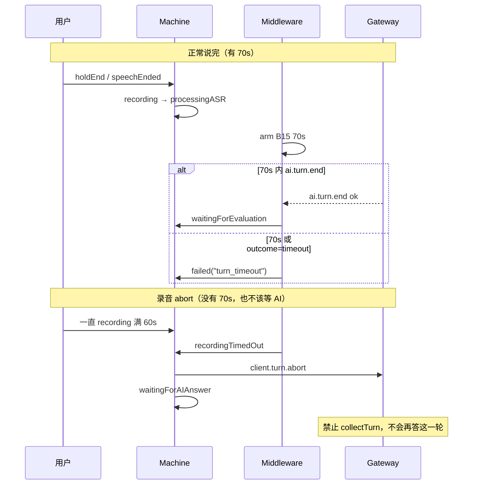
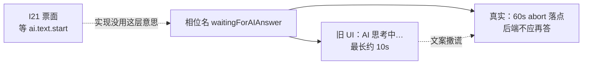
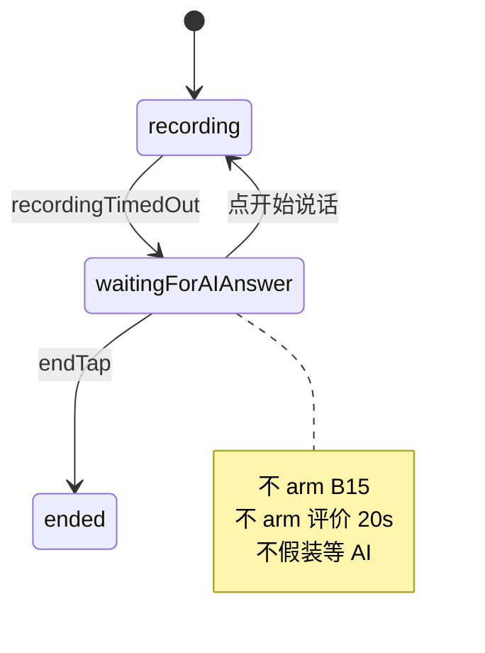
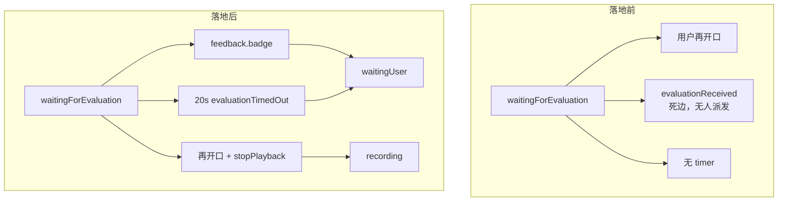
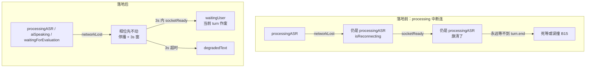
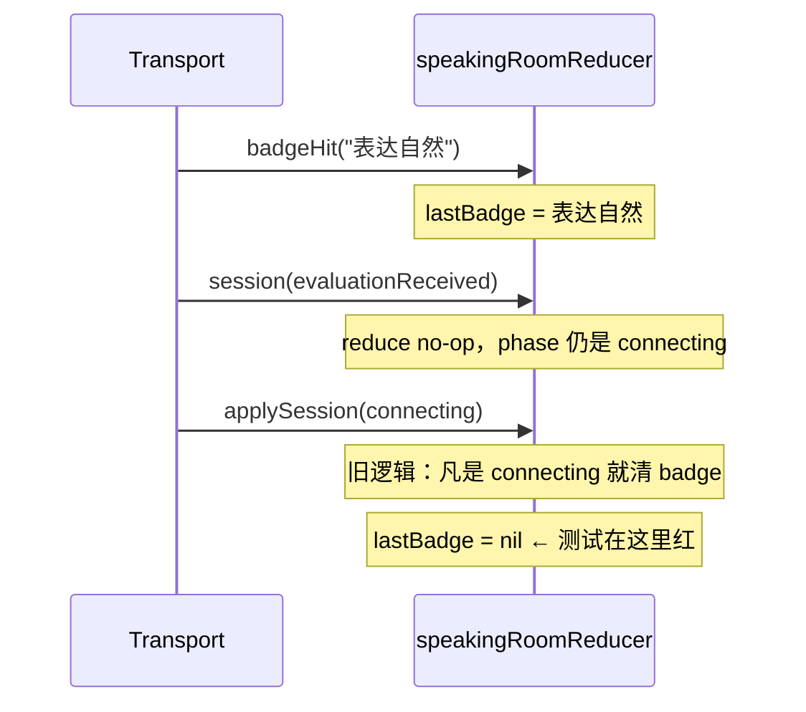
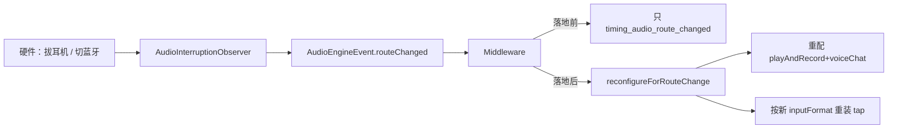
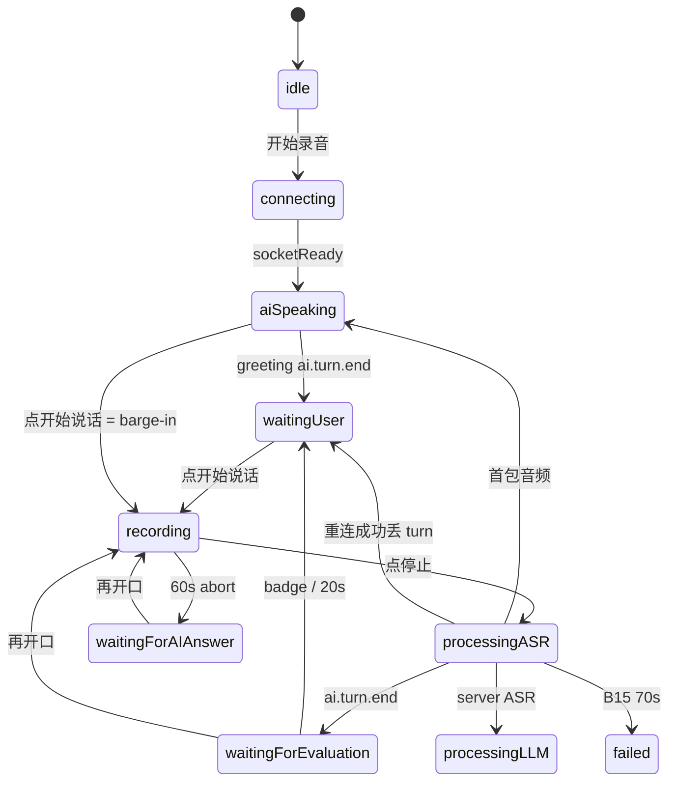

# 等待相位收口：问题分析与图例

**日期**：2026-09-10  
**读者**：后续改 SpeechSession / WSS / 说的房间 UI 的人  
**对照实现**：`docs/37_wait_phase_watchdog_and_failure_matrix.md`  
**门禁**：`swift test` 403/403；Host Debug iPhone 16 / OS 18.5  

本文不是票面小结。它记录这次更新**实际撞上的洞**：哪些是报告评审说对了、哪些处方是错的、落地时又新踩了哪几脚。每节都有图。

---

## 0. 一张总图：三条「等太久」不能合成一条

评审建议给 `waitingForAIAnswer` / `waitingForEvaluation` 统加 90s watchdog。这是这次最贵的误判。三条等待的**对象、时限、失败语义**都不一样：



| 路径 | 等的是 | 超时后 | 能不能共用 timer |
|---|---|---|---|
| I20 abort | 用户闭嘴 / 再开口 | 会话继续，UI「本轮已超时」 | 否 |
| B15 | `ai.turn.end` | **杀会话** | 否 |
| 评价等待 | `feedback.badge` | 回 `waitingUser`，不失败 | 否 |

---

## 1. 洞一：评审把「说完之后」和「abort 之后」画成同一条死等

### 1.1 评审怎么说

> 用户说完 → abort **或** 正常结束 → 进入等待相位 → 服务端不回帧就会永远挂住。唯一出路是关会话。

### 1.2 代码里其实是两条路



**正常说完**进的是 `processing*`，B15 已经在跑。  
**abort** 才进 `waitingForAIAnswer`，而且网关被合同禁止再 collectTurn。

评审说的「死等 AI」对 abort 路径是假问题：客户端在等一个**不会到来的 AI**。真问题是 UI 撒谎（下一节）。

对评价等待，评审说对了半句：`ai.turn.end` 时 B15 已被 `disarm`，之后确实没有 timer。但默认手动模式有「开始说话」，**不是只能关会话**。

### 1.3 处方

不要 90s。abort 落点改文案、让用户再开口。评价等待单独 20s，超时回 `waitingUser`。

---

## 2. 洞二：abort 落点相位名 / 文案 / 票面三重漂移

### 2.1 三套互相打架的语义



| 来源 | 它以为这个相位在干什么 |
|---|---|
| I21 原稿 | turn 已发，60s 内没等到 `ai.text.start` |
| 相位 enum 名字 | 等 AI 回答 |
| 旧 UI | 「AI 思考中」，还写了不存在的 10s timer |
| `docs/24` / 机器 | 录音 abort 插入态，下一轮可以开口 |

10s 从未在 middleware 里 arm。用户若信文案，会干等一个已 abort 的 turn。

### 2.2 修法（为什么不改回 `waitingUser`）

保留相位，改文案为「本轮已超时」，`showsProgress = false`。tracker 的 `from/to` 仍能把 abort 和普通等待分开。



---

## 3. 洞三：评价等待是一条死边，而且协议里根本没有 eval.frame

### 3.1 落地前

状态机有 `.evaluationReceived → waitingUser`，**transport 从不派发这个事件**。I21 文档自己写「eval.frame 还没有时，用户开口即可离开」。

Backend 侧：

- turn 级反馈 = WSS `feedback.badge`（还经常没有，因为没命中语料）
- 会话级评价 = REST / worker（I16），**不是**说话过程中的帧

所以「等评价」若理解为等 I16 review JSON，会永远等不到。



### 3.2 badge 可能早于 `ai.turn.end` 到达

DevEcho 上 badge 和 turn.end 顺序不保证。若只在 `waitingForEvaluation` 里听 badge，先到的那帧会被丢掉，然后 20s 空等。

```mermaid
sequenceDiagram
    participant GW as Gateway
    participant Box as EvaluationArrivalBox
    participant M as Machine

    Note over GW,M: 竞态 A：badge 先到
    GW->>Box: feedback.badge → mark()
    GW->>M: ai.turn.end → waitingForEvaluation
    M->>Box: consume() == true
    Box->>M: 立刻 evaluationReceived → waitingUser

    Note over GW,M: 竞态 B：badge 后到
    GW->>M: ai.turn.end → waitingForEvaluation
    M->>M: arm 20s
    GW->>M: feedback.badge → evaluationReceived
    M->>M: waitingUser，cancel 20s
```

`EvaluationArrivalBox` 就是为竞态 A 准备的。新一轮 `recording` 会 `reset()`，避免上一轮迟到 badge 误关下一轮等待。

---

## 4. 洞四：生产重连走的是 `socketReady`，不是票面上的 `reconnectSucceeded`

### 4.1 症状

`SpeechSessionEvent.reconnectSucceeded` 只有状态机和单测在用。transport 把 `.connected` 映射成 `.socketReady`。

旧行为：processing 中掉线 → 相位不动 + `isReconnecting` → socket 回来只清旗、**仍停在 processingASR**。服务端那一轮已经没了，客户端继续等 `ai.turn.end`，直到 B15 70s 杀会话——或者更糟，70s 已被 disarm 时就真死等。



`discardsTurnOnReconnect` 只覆盖 in-flight AI 轮：processing*、`aiSpeaking`、`waitingForEvaluation`。  
abort 落点 `waitingForAIAnswer` **不丢**：那一轮已经 abort，用户本来就要再开口。

### 4.2 实现时踩的测试坑

有一条旧测试叫 `duplicateSocketReadyWhileProcessingASRIsIdempotent`：processing + `isReconnecting` + `socketReady` 期望**留在 processing**。那不是不变量，是这个洞被写成了绿灯。本版改成「丢 turn」，并另留一条「未在重连时 duplicate socketReady 仍是 no-op」。

---

## 5. 洞五（落地时新踩）：`applySession(.connecting)` 每次都清 badge

### 5.1 现象

`feedbackBadgeLeavesWaitingForEvaluation*` 是绿的，但更老的接线测试挂了：

- `speechSessionMiddlewareConsumesTransportBadgeEvents`
- `backendFeedbackBadgeJSONDecodesIntoStoreEntries`

它们在 **connecting** 阶段就 emit `feedback.badge`（只等到 `startSession`，不等 `socketReady`）。

### 5.2 因果

本版 transport 对 badge 连发两枪：`badgeHit` 然后 `.session(.evaluationReceived)`。

connecting + `evaluationReceived` 是状态机 no-op，但 middleware 仍 `applySession(当前 session)`。旧 reducer：

```text
if session.phase == .connecting { lastBadge = nil; badgeHits = 0 }
```

于是：badge 写上 → no-op apply → **立刻擦掉**。



### 5.3 修法

只在 **进入** connecting 时清（`old != connecting && new == connecting`）。会话启动仍会清上一场；connecting 期间的 no-op 事件不再误杀 badge。回归：`applySessionConnectingAgainDoesNotClearBadge`。

这是「多派发一个 session 事件」暴露的旧不变量过宽，不是 badge 解码坏了。

---

## 6. 洞六（测试）：`stopPlayback` 是异步的

`evaluationTimedOut` 的机器副作用是 `.stopPlayback` → middleware `interruptNow()`。集成测试在 `waitForPhase(.waitingUser)` 之后立刻 `interruptCalls == 1` 会偶发 0，因为 fire-and-forget 还没跑完。

改成 `waitUntil { interruptCalls >= 1 }`。不要把异步副作用当成 reduce 同步返回值。

---

## 7. 洞七：路由切换以前只打点



不重置 speech tracker：录音中途换设备不应误发 `speechEnded`。configure 失败也不杀会话（拔耳机不应比断网更致命）。真机蓝牙仍未验。

---

## 8. 主路径对照图（默认手动开口）



默认 barge-in **不是**能量 VAD：`aiSpeaking` 上的按钮 → `beginManualSpeech` → `interrupt`。`voiceVadAuto` 才走能量。会话已要 `.voiceChat`（系统 AEC），真机未测。

---

## 9. 这次更新的决策记录（避免下次回潮）

| 提议 | 为什么拒绝 / 为什么接受 |
|---|---|
| 两个等待相位共用 90s | 拒绝。等的东西不同，失败语义也不同 |
| abort 后 arm B15 | 拒绝。abort 禁止 collectTurn |
| 评价超时 `.failed` | 拒绝。turn 已经 `ai.turn.end ok` |
| 把 abort 落点改成 `waitingUser` | 拒绝。要保留 abort 打点 |
| 用 `feedback.badge` 当评价信号 | 接受。WSS 没有别的 turn 级评价帧 |
| 无 badge 就 20s 跳过 | 接受。多数 turn 不会命中语料 |
| 重连后重放 PCM | 拒绝。网关 turn 已作废 |
| I15 卡住仍去写 Opus | 拒绝。下一手是 I14 |

---

## 10. 和 `docs/37` 的分工

| 文档 | 读它做什么 |
|---|---|
| `docs/37` | 合同：现在行为、测试名、明确不做 |
| **本文** | 分析：洞从哪来、图怎么走、落地时踩了什么 |
| `docs/24` | B15 vs I20 两条 timeout 的长期维护合同 |

改等待相位或重连语义之前，先看这三张图有没有被画破：§0 总图、§3 badge 竞态、§4 重连丢 turn。
