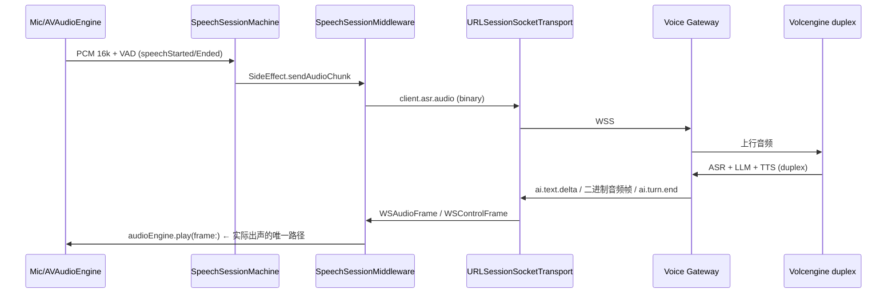
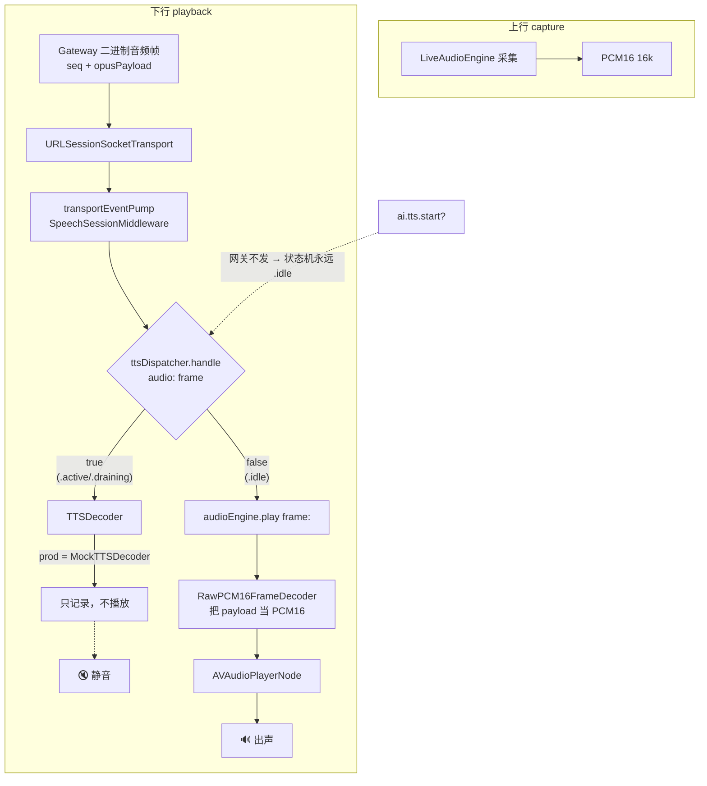
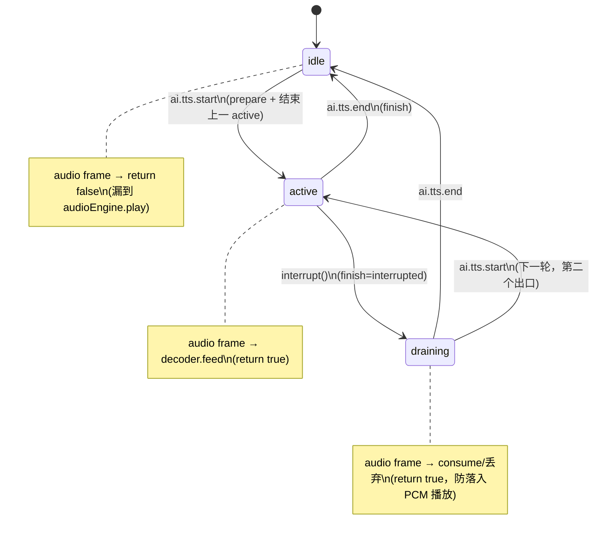
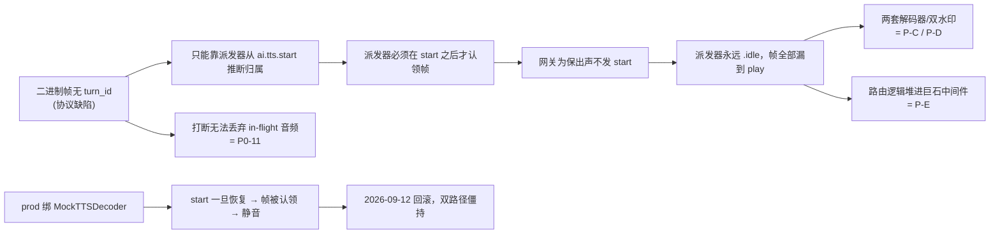

# 01 — 现状架构审计

> **修订（2026-09-20）**：本文是 **Stage 2/3 之前的**现状快照，写的是当时的代码，**未按现状改写**（它的价值就是当时观察到了什么）。两处前提此后都已消失，读的时候请先换掉：
>
> - 「网关当前**不发** `ai.tts.start`」（§0 事实 1）—— 网关现在**总是**发（后端 `3cb3774`；顺序由 `afe5eb5` 修正为首帧音频之前、每轮一次）。
> - 「`audioEngine.play(frame:)` 是实际出声的唯一路径」（§1、§2、§4）—— 该入口今天已无生产调用点（legacy 路径随 `d004869` 删除；函数本身还在 `LiveAudioEngine.swift:719`，只有测试在调）；唯一的出声路径是 `TTSPlaybackCoordinator` → `AudioSink.play(pcm:)` → 引擎。
>
> 本文的诊断仍然成立：它指出的病根（轮次归属被放进控制帧的时序推断里）正是后来被修掉的那件事。修法不是本文设想的「帧自带 `turn_id`」（那版从未实施），而是「用 `ai.tts.start`/`ai.tts.end` 括出归属区间 + 显式查表」。

## 0. 结论先行

这条链路的「能出声」不是设计出来的，而是**一次偶然回滚的副产品**。它由三条独立事实叠加而成，缺一条就静音：

1. 网关当前**不发** `ai.tts.start`。
2. `TTSFrameDispatcher` 只有在见过 `ai.tts.start` 后才会认领二进制音频帧（`TTSDecoder.swift:106-125`，`.idle` 返回 `false`）。
3. 生产环境 DI 把 `TTSDecoder` 绑成了 `MockTTSDecoder`——一个只记录、不播放的录音机（`AppDependencies.swift:556`）。

事实 1 + 事实 2 让所有二进制帧「漏」过派发器，落到 `audioEngine.play(frame:)` 直接播（事实 3 因此不生效）。**一旦为了让打断可丢弃 in-flight 音频而让网关补发 `ai.tts.start`（这是轮次归属的前提），事实 2 反转让帧被派发器认领，事实 3 让这些帧全部变成静音。** 这正是 2026-09-12 已经发生并被回滚的事。

---

## 1. 端到端语音链路（正常运行时）



要点：**回放**（下行）只有一个真正工作的入口 `audioEngine.play(frame:)`，而它本应是「备用」路径。

---

## 2. 双播放路径：设计 vs 实际



**这条图就是整个问题的全部。** 同一份二进制音频，命运完全取决于一个与音频本身无关的、且当前不会发生的前置控制帧。

---

## 3. `TTSFrameDispatcher` 状态机



源码解读（`TTSDecoder.swift`）：

- **`.idle` 是「双路径分叉」的物理位置**（`TTSDecoder.swift:106-125`）：`case .idle: return false`。这个 `false` 就是路由到 `audioEngine.play` 的信号。
- **`.draining` 的第二个出口**是被测试钉住的（`testTTSDispatcher_NewStartEndsAStuckDrainingStream`）：一个被废弃的轮不会收到 `ai.tts.end`，若没有 `ai.tts.start` 无条件覆盖（`TTSDecoder.swift:58-79`），流会卡死在 `.draining` 并吞掉下一轮音频——症状是静音。
- 状态机用 `DispatchQueue.sync` 串行化（`TTSDecoder.swift:47`），是 `@unchecked Sendable` + 串行队列的「锁盒子」写法。

---

## 4. 中间件路由点（`SpeechSessionMiddleware.swift:646-691`）

```swift
case let .audio(frame):
    // ...
    let consumedByTTS = try ttsDispatcher.handle(audio: frame)
    if consumedByTTS {
        // ttsTrace.recordAudio() / tts_first_audio 埋点
    } else {
        await audioEngine.play(frame: frame)   // ← 实际出声的唯一路径
    }
```

同一段代码还顺带承担：`aiFirstAudioChunk` 派发、`timings.mark`、`markFirstResponse`、TTS 埋点、错误埋点。`transportEventPump` 是 1495 行的巨石 switch，一个 case 里塞了传输、TTS 路由、响应计时、埋点四件事。

---

## 5. 组件清单

| 组件 | 位置 | 真实角色 | 状态 |
|------|------|---------|------|
| `TTSFrameDispatcher` | `Audio/TTSDecoder.swift` | 双路径分叉器（本应做轮次归属） | 生产常驻，但永远 `.idle` |
| `MockTTSDecoder` | `Audio/MockTTSDecoder.swift` | 只记录的占位 | **生产绑定** |
| `EngineBackedTTSDecoder` | `Audio/EngineBackedTTSDecoder.swift` | 真正能播的桥（AsyncStream） | 已写已测，**被回滚** |
| `WSAudioFrameDecoder` / `RawPCM16FrameDecoder` | `AppDependencies.swift:123-162` | 把 payload 当 PCM16 的解码器 | 生产生效（路径 B） |
| `LiveAudioEngine.play(frame:)` + `AudioPlaybackGate` | `Services/LiveAudioEngine.swift` | 真正播放 + 第二道水印 | 生产生效 |
| `BargeInAudioGate` | `Networking/Socket/` | 传输层第一道水印 | 生产生效 |

---

## 6. 问题清单

| 编号 | 问题 | 严重度 | 证据 |
|------|------|--------|------|
| **P-A** | **双播放路径靠巧合共存**：设计路径是死的，实际路径是「漏帧」 | 🔴 致命 | `AppDependencies.swift:538-557` 的 rollback 注释；`EngineBackedTTSDecoder.swift:4-14` 自述「That accident is the only reason audio still works」 |
| **P-B** | **二进制帧无轮次归属**（只有 `sequence`，无 `turn_id`），无法在打断时丢弃被中断轮的 in-flight 音频 → P0-11（61s 延迟音频） | 🔴 致命 | `WSAudioFrame = {sequence, opusPayload}`；`SpeechSessionMiddleware.swift:661-663` 注释自认「resolves to the turn most recently started」 |
| **P-C** | **两个解码器、两套 wire 假设**：`TTSDecoder` 视 payload 为 Opus，`RawPCM16FrameDecoder` 视 payload 为「已经是 PCM16」——语义相反 | 🟠 高 | `TTSDecoder.swift:8`（codec: "opus"） vs `AppDependencies.swift:138-149`（treats opusPayload as already-PCM16） |
| **P-D** | **两个独立的水印门禁**：`BargeInAudioGate`（传输）+ `AudioPlaybackGate`（引擎），同一目的、两处实现、无单一真相 | 🟠 高 | `P1-7`（水位线生命周期错配）；`AudioFrameDropGate.swift` vs `LiveAudioEngine.swift` |
| **P-E** | **巨石中间件**：`transportEventPump` 一个 switch 承担传输 + TTS + badge + ASR + 计时 + 错误 | 🟠 高 | `SpeechSessionMiddleware.swift`（1495 行） |
| **P-F** | **锁盒子状态**：`@unchecked Sendable` 类 + `OSAllocatedUnfairLock` / 串行队列，横跨 @MainActor 与 detached pump | 🟡 中 | `TTSFrameDispatcher`、`TurnCountBox`、`SessionPhaseBox` 等 |
| **P-G** | **AsyncStream 单消费者脆弱性**：`EngineBackedTTSDecoder` 用「一个消费者 Task」保证顺序，但没有背压/溢出语义 | 🟡 中 | `EngineBackedTTSDecoder.swift:41-52`；F21 历史 |

---

## 7. 根因链



**一句话根因**：轮次归属被放在了「控制帧时序推断」里，而不是「数据帧自描述」里。这是把本应属于数据的属性，错放到了控制流的副作用上。

---

## 8. 审计方法注记

本审计从**测试**反推契约（见 `04`）。三条已经钉住的测试尤其重要，它们揭示了系统「真实的、被当作契约的」行为：

- `testTTSDispatcher_IgnoresAudioBeforeStart`（`AITTSFramesTests.swift:113`）——把「`.idle` 漏帧」这个事故**钉成了契约**。
- `testTTSDispatcher_NewStartEndsAStuckDrainingStream`（同上 `:176`）——把「第二个出口」钉成了承载假设。
- `engineBackedDecoderPlaysInTheOrderItWasFed`（`EngineBackedTTSDecoderTests.swift:14`）——把顺序不变量钉住，但它测的组件**根本不接生产**。
