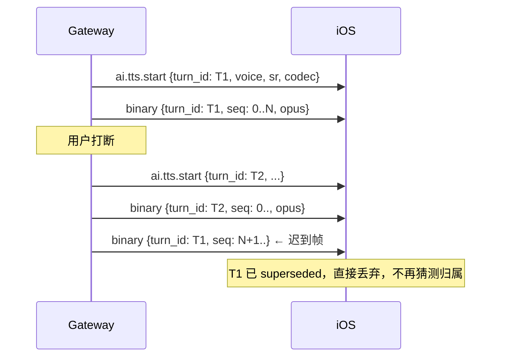
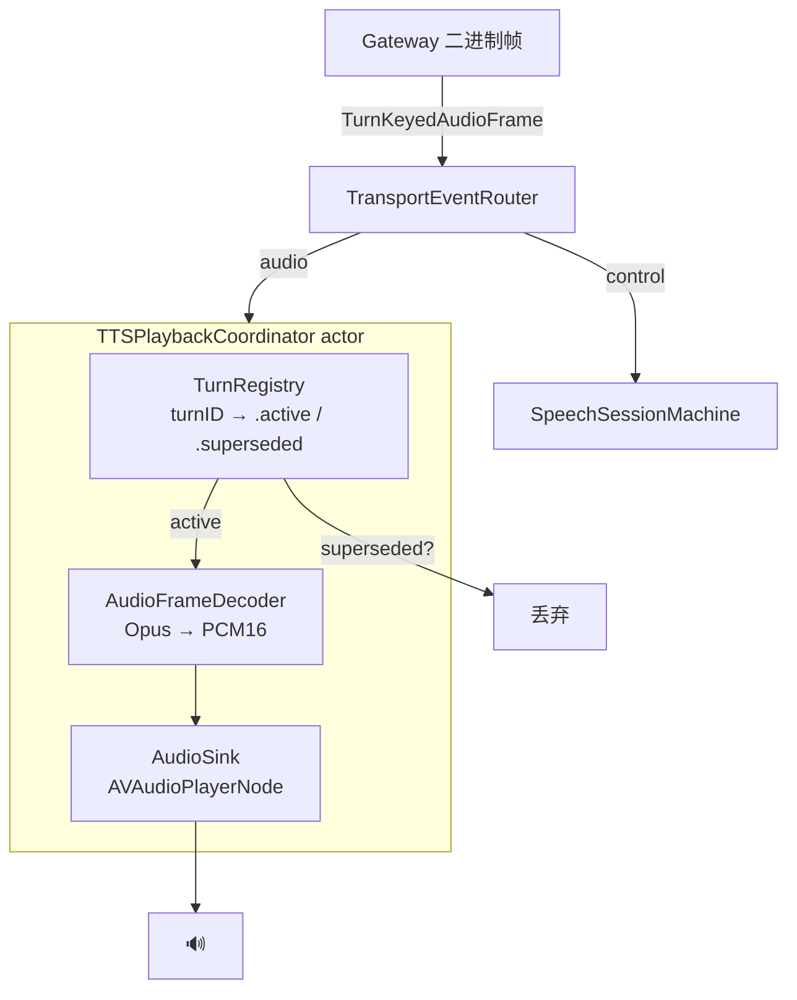
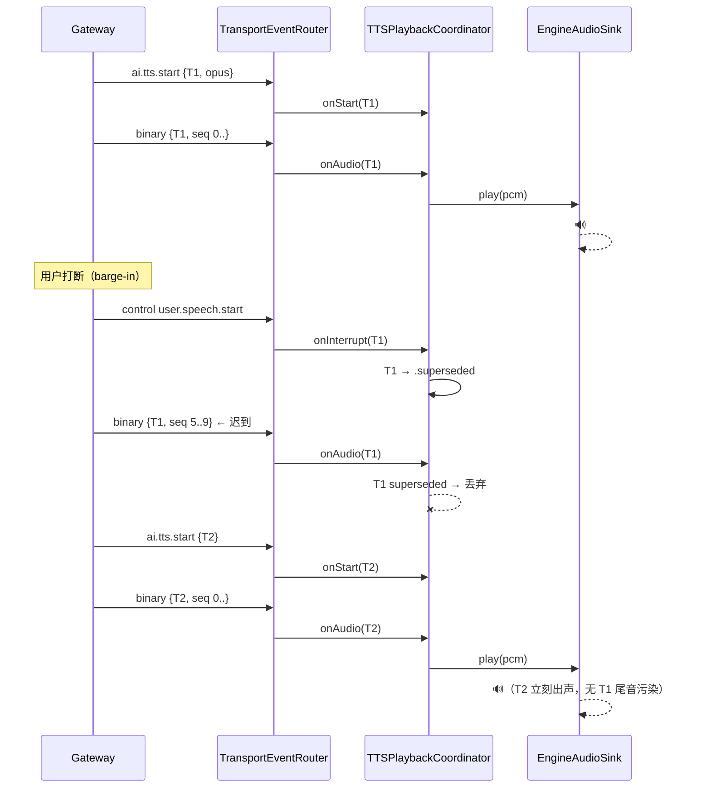
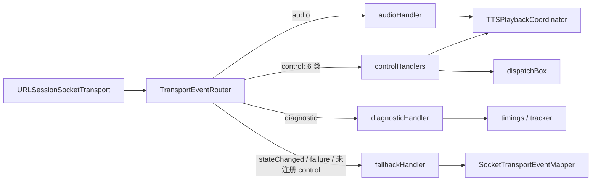
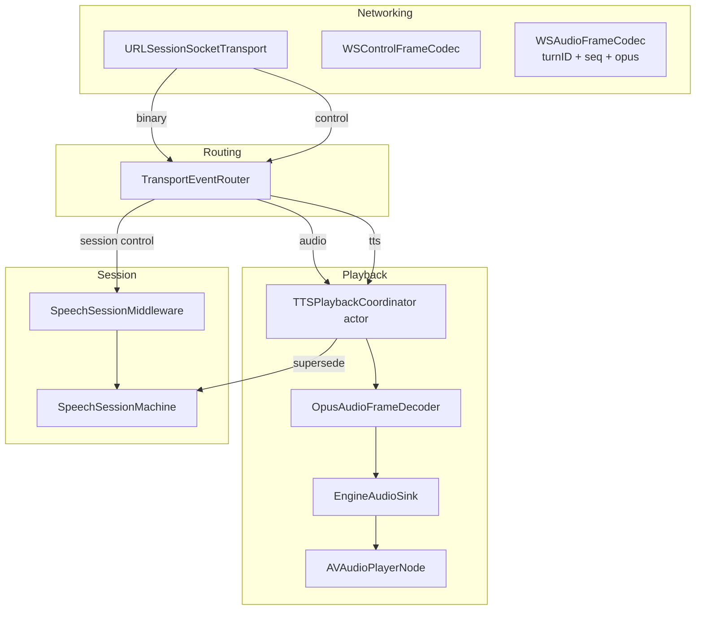

# 02 — 目标架构与组件设计

> 本节回答：如果让我从零实现同样的「AI 语音回放」组件，我会怎么设计。
> 不迁就现状，先讲清楚「对的形态」，第三节再讲如何从现状一步步迁过去。

## 0. 四条设计原则

1. **数据自描述，归属不进控制流**。二进制帧必须自带 `turn_id`。轮次归属是数据的属性，不是从 `ai.tts.start` 的时序里推断出来的状态。
2. **单一回放汇点（single sink）**。所有下行音频只经过一个组件进播放器，不存在「派发器认领」和「漏到 play」两条路。
3. **单一解码 seam**。解码器只有一个协议：`payload → PCM16`。Opus 与否是实现细节，藏在 seam 后面。
4. **actor 优先，锁盒子次之**。可变的会话状态放进 actor，靠隔离不靠 `@unchecked Sendable` + 锁。

---

## 1. 决策一：二进制帧带 `turn_id`

> **修订（2026-09-20）**：这条决策**从未实施**。线上二进制帧至今仍是「4 字节大端 seq + payload」，帧上不带 `turn_id`（`WSAudioFrameCodec.swift:9`；契约 `83_` §1 定案「格式一个字节都不改」）。最终走通的是相反的一条路：**归属由 `ai.tts.start` / `ai.tts.end` 在时间轴上括出的区间决定**，客户端拿「当前归属指针」解析裸帧（`TTSPlaybackCoordinator.onAudioFrame:136-143`）。下面的时序图、「协议兼容策略」与 `TurnKeyedAudioFrame.turnID` 的语义都按「帧自带 turn_id」写，属未采用的方案，保留作对照。

把 `WSAudioFrame` 从 `{sequence, opusPayload}` 扩展为 `{turnID, sequence, opusPayload}`（或新增 `TurnKeyedAudioFrame`，见下）。这是我当时认为**唯一需要动后端契约**的决策，对应 `meta docs/30_技术方案/83_轮次归属_方向A契约草案`；契约最终选择了不动帧格式。



带 `turn_id` 之后，「丢弃被中断轮的 in-flight 音频」变成一次字典查找，而不是状态机时序猜测——**这直接修掉 P0-11 的根因**。

### 协议兼容策略

> **修订（2026-09-20）**：这段过渡期策略被**反向执行**了。实际落地的兼容分支是「`turn_id == nil` → **丢弃**」，不是「→ 走旧路径」：`TTSPlaybackCoordinator.onAudio` 对无归属的帧返回 `.dropped(reason: .unknownTurn)`（`:154-156`）。`audioEngine.play(frame:)` 在 2026-09-20 已被删除。「两侧解耦、可独立回滚」也没有兑现——网关开始发 `ai.tts.start` 与客户端删掉 legacy 回退发生在同一个窗口，任一侧单独倒退的产物都是静音，不是降级。

以下两段保留原样，作为未采用方案的对照。

向后兼容不能破坏现有 `.idle` 漏帧路径（因为改后端契约有排期）。因此**在过渡期保留 `turn_id` 为可空**：

- `turn_id == nil` → 走旧路径（`audioEngine.play`），行为与今天完全一致。
- `turn_id != nil` → 走新 `TTSPlaybackCoordinator`，参与 supersede 判定。

这样 iOS 可以先上线新组件，后端分批补 `turn_id`，两侧解耦、可独立回滚。

---

## 2. 决策二：单一 `TTSPlaybackCoordinator`（actor）

把「谁拥有这帧、要不要播、播给谁」收进一个 actor。它同时取代 `TTSFrameDispatcher`（路由）+ `EngineBackedTTSDecoder`（桥）+ 引擎里的水印门禁。



### 接口（Swift 伪代码）

```swift
/// 下行音频帧：数据自带的轮次归属。
struct TurnKeyedAudioFrame: Sendable, Equatable {
    var turnID: String?        // 落地版：nil 一律丢弃（原设计的「走兼容路径」未采用）
    var sequence: UInt32
    var payload: Data          // Opus 或 PCM16，由 decoder 决定
}

/// 唯一的音频解码 seam：payload → 16k mono PCM16。
protocol AudioFrameDecoder: Sendable {
    func decode(_ frame: TurnKeyedAudioFrame) async throws -> Data
}

/// 单一回放汇点。
actor TTSPlaybackCoordinator {
    private let decoder: any AudioFrameDecoder
    private let sink: any AudioSink          // 抽象播放器，便于测试
    private var turns: [String: TurnState]   // .active / .superseded
    private var gate: PlaybackWatermark      // 唯一的水印门禁

    /// 下行音频唯一入口。
    func onAudio(_ frame: TurnKeyedAudioFrame) async {
        guard let turnID = frame.turnID else {
            await sink.play(legacy: frame)   // 未采用：落地版这里是 return .dropped(.unknownTurn)
            return
        }
        guard turns[turnID] == .active, gate.shouldAccept(frame) else {
            return                            // superseded 或超水位 → 丢弃
        }
        do {
            let pcm = try await decoder.decode(frame)
            await sink.play(pcm: pcm)
        } catch { /* 埋点 tts_decoder_failed */ }
    }

    func onStart(turnID: String, voice: VoiceConfig) async {
        turns[turnID]?.supersede()            // 上一轮 in-flight 立即失活
        turns[turnID] = .active(voice)
        gate.reset(for: turnID)               // 水位按轮重置（修 P1-7）
    }

    func onEnd(turnID: String) async { turns[turnID] = nil }
    func onInterrupt(turnID: String) async { turns[turnID]?.supersede() }
}
```

对比现状，关键变化：

| 现状 | 目标 |
|------|------|
| `TTSFrameDispatcher` 从 `ai.tts.start` 时序推断归属 | `turn_id` 在数据里，`TurnRegistry` 直接查表 |
| `.idle` 返回 `false` 是「漏帧」信号 | 没有 `false` 分支，只有「播 / 丢」 |
| 生产绑 `MockTTSDecoder` | `TTSPlaybackCoordinator` 内建真实 decoder，不存在「录音机」 |
| 水印在传输 + 引擎两处 | `gate` 一处，且按轮重置 —— **未采用**：协调器里从未建过 `PlaybackWatermark`（全仓零命中）。实际收到一处的是反过来的那一半：引擎那道 `AudioPlaybackGate` 被删了（它不可能被武装，见 `07` §2），barge-in 的丢弃只剩传输层 `BargeInAudioGate`。方向不同：不是"把两处合成一处放进协调器"，而是"删掉多余的那一处"。**（2026-09-22 补）** 传输层那道后来也删了（`18_`），所以最终形态是「一处都没有，只剩协调器的轮次归属」——方向没变，只是「多余的那一处」有两处而不是一处 |
| `EngineBackedTTSDecoder` 用 AsyncStream 桥同步/异步 | actor 天然异步，无桥、无单消费者脆弱性 |

---

## 3. 决策三：`AudioSink` 抽象

把 `AVAudioPlayerNode` 的调用收敛到一个 `AudioSink` 协议，让 `TTSPlaybackCoordinator` 可被单元测试（注入 `RecordingSink`）而不必拉起真实音频引擎。

```swift
protocol AudioSink: Sendable {
    func play(pcm: Data) async        // 16k mono PCM16，内部 makePCMBuffer + enqueue
    func play(legacy frame: TurnKeyedAudioFrame) async  // 未采用：legacy 路径已删
    func interruptNow() async
    func drain() async                // 未采用：假能力，已删
}
```

> **修订（2026-09-20）**：落地版的 `AudioSink` 只剩两条 —— `play(pcm:)` 与 `interruptNow()`（`Shared/FluentWorkCore/Audio/AudioSink.swift`）。`play(legacy:)` 随 legacy 路径一起删除（`d004869`）；`drain()` 在 `06` §5 里作为「假能力」删掉（三个实现都是 no-op，而 `AVAudioPlayerNode` 根本没有同步等待 API）。

`LiveAudioEngine` 现有的 `play(frame:)` / `makePCMBuffer` / `enqueueWithoutWaiting` 逻辑原样搬进一个 `EngineAudioSink`，**引擎本身不再直接对下行帧做决策**——它退化为「被 sink 调用的播放器」。

> **修订（2026-09-20）**：这个搬移也没发生。`EngineAudioSink` 写出来过，但从未接线，已在 Stage 4 删除。落地选的是**「引擎自己就是 sink」**（`AudioEngineProtocol: AudioSink`，`AppDependencies.swift:74-80`），理由是 `playbackRetired` 这个守卫不能被绕过——换一个对象去播，症状是「结束练习后又被迟到帧拉起来」（`06` §2.1）。（当时列出的第二个理由 `AudioPlaybackGate` 已随 `play(frame:)` 删除：那道门不可能被武装，见 `07` §2。）所以下面这条「引擎不再直接对下行帧做决策」只对了一半：引擎确实不再做**轮次归属**的决策，但 `playbackRetired` 这道守卫仍在它自己身上。

---

## 4. 目标端到端时序（含打断）



---

## 5. `TransportEventRouter`（拆出巨石中间件）

> **修订（2026-09-20，第二次）**：本节第一次修订记的是「这个重构没有发生」。**现在发生了，
> 但不是按下面那张图的样子**。两条更正，都是实现时才看清的：
>
> 1. **图里的 `BadgeSink`、`ErrorHandler`、`Telemetry` 三个 owner 从来不存在**，也不该被发明
>    ——全仓 grep 零命中。而 `SpeechSessionMachine` 是一个纯 `enum`、状态存在 Redux store 里：
>    一个 router actor 没法"调用"它，除非再造一个状态镜像，而那是刚修好的音频路径上新增的
>    一类同步 bug。所以**没有把中间件拆成 owner 分离**——handler 定义在中间件**内部**，
>    闭包捕获它本来就能拿到的 `dispatchBox` / `tracker` / `timings`。
> 2. **中间件没有被拆小。** 路由只占它 1470 行里的约 275 行（19%）；剩下的是 reducer 调用、
>    副作用解释器、超时矩阵——那些不是路由。把 switch 换成路由表之后中间件仍是 ~1400 行，
>    而且它还有**第二个**大 switch（`audioEventPump`，209 行），router 不覆盖它。
>
> 下面这张图改写成了实际的样子：



四个 handler 都是**在中间件里就地定义的闭包适配器**，不是新的 owner 类型。
`makeTransportEventRouter` 一次组装，`transportEventPump` 的循环体只剩
`await router.route(event: event)`。

### 落地时的三处 API 更正（原设计的形状会接错线）

| 原设计 | 问题 | 实际做法 |
|---|---|---|
| `route(event:) -> TransportEventResult` | 零消费者；它的 `Equatable` 住在**测试目标**里；留着就得为 `.failed(String)` 发明一套策略 | 删掉结果类型，三个协议返回 `Void`——处理成不成功由 handler 自己决定并自己 dispatch |
| `.failure` 硬编码 `return .ignored` | 而 pump 把 socket 失败路由到 `networkLost`/`.failed`——**照原样接线会静默吞掉断线** | 统一交给新的 `fallbackHandler`（原 `stateChangeHandler` 改名并扩大职责），它同时接管 `.stateChanged`、`.failure`、以及没注册 handler 的控制帧 |
| `actor TransportEventRouter` | 四个字段全是 `let`、零状态；唯一调用者是一条串行 `for await` 循环。而音频**一帧一个事件**，250 帧的回合就是 250 次额外 actor 跳转 | 改成 `struct: Sendable`；`route` 仍是 `async`（handler 本身是 async） |

另外 `WSControlFrameType` 这个手工镜像收敛到了 `FluentWorkNetworking`、与 `WSControlFrame` 同址：
`String` 原始值直接取线上 discriminator，映射收成 `WSControlFrame.wireType` 一个**穷尽 switch**
——新增帧类型会编译失败，镜像不会漂移。

### 仍然没有做到的（别当成已完成）

- 中间件**没有**被拆成 owner 分离；计时与埋点仍在同一个文件里（它们在 handler 体内）。
- `audioEventPump`（**:355-563**，10 个 case）**没有被路由化**，router 不覆盖它。
- 原图里的 `Telemetry` owner 不存在。要不要抽是独立决定。
- **本轮只跑了 `swift test`，未做真机验证**——见 [`07`](./07_Stage4_删除死路径.md) §5。

---

## 6. 目标架构全景



---

## 7. 这套设计如何逐条消掉现状问题

| 现状问题（见 01 §6） | 目标里的对应解法 |
|----------------------|-----------------|
| P-A 双路径靠巧合 | 单一 sink，无「认领/漏帧」分叉 |
| P-B 无轮次归属 | `TurnKeyedAudioFrame.turnID` + `TurnRegistry.supersede` |
| P-C 双解码器语义相反 | 单一 `AudioFrameDecoder` seam，Opus 藏在后面 |
| P-D 双水印门禁 | 单一 `PlaybackWatermark`，且按轮重置（顺带修 P1-7） |
| P-E 巨石中间件 | `TransportEventRouter` 拆路由，业务下沉到各 owner |
| P-F 锁盒子状态 | actor 隔离，`turns` 字典活在 actor 里 |
| P-G AsyncStream 单消费者 | actor 天然异步，删掉桥 |
