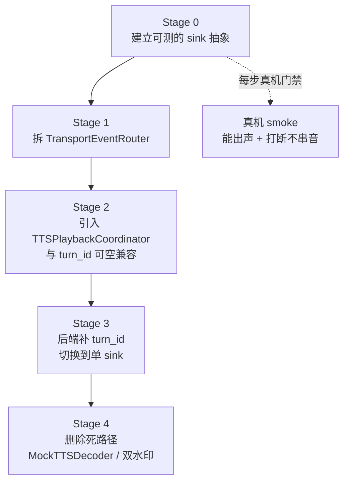
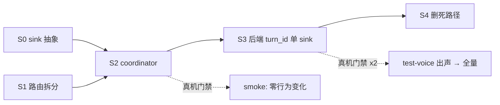

# 03 — 重构建议与迁移路径

> 本节回答：不推倒重来，如何把现状（01）一步步改到目标（02）。
> 核心约束：**失败模式是静音**，且单元测试看不到静音——所以每一步都必须可独立回滚，并在关键节点上真机门禁。

> **修订（2026-09-20）**：本文是计划，不是结果，**未按现状改写**。落地情况：
>
> - **S0（`AudioSink` 抽象）落地**，但落法和本文设想的不同——`EngineAudioSink` 没接线、被删了，「引擎自己就是 sink」（`06` §2.1）。
> - **S1（拆 `TransportEventRouter`）已接线**（2026-09-20 当天第二次修订）：路由器成为传输事件的真实分发点，那个 237 行的 switch 收敛成 `await router.route(event: event)` 一行。**但中间件没有被拆成 owner 分离**——原图里的 `BadgeSink`/`ErrorHandler`/`Telemetry` 三个 owner 从来不存在，而 `SpeechSessionMachine` 的状态在 Redux store 里、router 接管不了，所以 handler 定义在中间件内部。中间件仍是 ~1400 行，`audioEventPump`（209 行）仍是第二个大 switch。详见 `02` §5。
> - **S2（可空 `turn_id` 双轨并存）落地**，但「`nil` 走旧路径」这一支被反向执行成「`nil` 即丢弃」（`d004869`）。
> - **S3（后端补 `turn_id`，切单 sink）从未发生**，被另一条路取代：后端不补 `turn_id`，改为保证 `ai.tts.start` 在首帧音频之前到达（`3cb3774`/`afe5eb5`），归属仍由时间区间决定。
> - **S4（删死路径）落地**（`e64237e`、`d004869`）；注意其中两个文件被 `f3bb127` 加了回来（`07` 有修订注）。
>
> 因此 §5 风险表里那几条以「turn_id 灰度」为前提的缓解手段（test-voice 分批、`TurnRegistry` 未知轮兜底策略）都没有被用上。

## 0. 迁移原则

1. **每步可回滚**。任何一步都不能让「今天的出声路径」依赖「还没落地的新组件」。
2. **静音是唯一不可接受的失败**，而单测测不到它（`AppDependencies.swift:553-554` 已明说）。所以涉及「start 恢复」的步骤必须真机验证。
3. **iOS 先行，后端跟进**。过渡期 `turn_id` 可空，两侧解耦。
4. **一步一测试**。每步由一条「先红」的测试驱动（见 04），红验证纪律见 `meta 78` §五。

---

## 1. 阶段划分与依赖

**关键排序理由**：先把「播放器」抽象成可注入的 `AudioSink`（Stage 0），才能让 Stage 2 的新 coordinator 在单测里用 `RecordingSink` 验证「播/丢」逻辑，而不必在真机上盲改。**没有 Stage 0，Stage 2 就是重演 2026-09-12 的盲人摸象。**

---

## 2. 各阶段明细

### Stage 0 — 建立 `AudioSink` 抽象（零行为变化）

**目标**：把 `LiveAudioEngine` 的播放职责收进 `EngineAudioSink`，引擎退化为「被调用的播放器」。不改任何路由，不改 wire 契约。

| 项 | 内容 |
|----|------|
| 改动 | 新增 `AudioSink` 协议 + `EngineAudioSink`（搬 `play(frame:)`/`makePCMBuffer`/`enqueueWithoutWaiting`） |
| 不变量 | `audioEngine.play(frame:)` 的调用点暂时保留，内部转调 `EngineAudioSink` |
| 风险 | 低——纯搬移 |
| 测试 | `EngineAudioSink` 的 PCM 缓冲构造 / 入队顺序（见 04 §3.1） |

### Stage 1 — 拆 `TransportEventRouter`（路由与业务分离）

**目标**：把 `transportEventPump` 的巨型 switch 拆成「路由表 → owner 调用」，计时/埋点/错误各自回 owner。行为零变化。

| 项 | 内容 |
|----|------|
| 改动 | 新增 `TransportEventRouter`；`SpeechSessionMiddleware` 只保留「接收 → 投递」 |
| 不变量 | 每条帧的最终去向与今天完全一致（用现有 `SpeechSessionMiddlewareTests` 锁住） |
| 风险 | 中——switch 分支多，靠「行为等价」测试兜底 |
| 测试 | 路由表快照测试：每种 `WSControlFrame`/`WSAudioFrame` 投到哪个 owner（见 04 §3.2） |

### Stage 2 — 引入 `TTSPlaybackCoordinator`（过渡期双轨）

**目标**：新 coordinator 上线，但只处理 `turn_id != nil` 的帧；`turn_id == nil` 的帧继续走旧路径。**这一步是双路径共存的显式化，而不是消除**——但新路径不再是「漏帧」，而是「查表」。

| 项 | 内容 |
|----|------|
| 改动 | 新增 `TurnKeyedAudioFrame`（turnID 可空）、`TTSPlaybackCoordinator`；路由器对音频帧按 turn_id 分派 |
| 不变量 | 网关不发 turn_id 时，行为与今天逐字节一致 |
| 风险 | 高——双轨并存期必须保证「有 turn_id 走新、无 turn_id 走旧」没有交叉 |
| 门禁 | **真机 smoke**：出声正常 + 打断不串音（此时后端还没发 turn_id，应观察到零行为变化） |
| 测试 | `RecordingSink` 验证 coordinator 的播/丢判定（见 04 §3.3） |

### Stage 3 — 后端补 `turn_id`，切到单 sink

**目标**：后端开始给二进制帧带 `turn_id`，所有帧统一进 `TTSPlaybackCoordinator`。**这是唯一一步会让「start 恢复」生效的地方**，也是 2026-09-12 翻车的同一处。

| 项 | 内容 |
|----|------|
| 改动 | 后端契约（`meta 83`）；iOS 打开「有 turn_id 全走新路径」 |
| 关键 | **必须先确认 coordinator 用的是真实 decoder，不是录音机**（这正是 Stage 2 测试锁住的） |
| 门禁 | **真机门禁分两步**：① 后端只对 1 个 test voice 发 turn_id → 真机验出声；② 再全量。静音即刻回滚 |
| 测试 | 集成：真实 socket 帧带 turn_id 全程出声（补 P1-22 结构性空白） |

### Stage 4 — 删除死路径

**目标**：删掉 `TTSFrameDispatcher`、`MockTTSDecoder`、`EngineBackedTTSDecoder`、`RawPCM16FrameDecoder` 里的旧假设，收敛为单一 sink + 单一水印。

| 项 | 内容 |
|----|------|
| 改动 | 删 `.idle` 漏帧契约、删双水印之一（保留引擎侧，按轮重置）、删 `MockTTSDecoder` 的 DI 绑定 |
| 不变量 | Stage 3 已全量走新路径后，旧路径是死代码，删掉不改变行为 |
| 风险 | 低——但删代码要留 commit 记录（参见项目惯例「死路标记不删」`meta 78` P1-15 的做法：先标记后删） |

---

## 3. 阶段依赖图（细化）

---

## 4. 与后端联动的排期要点

| 事项 | 依赖 | 说明 |
|------|------|------|
| 二进制帧带 `turn_id` | `meta docs/30_技术方案/83` | 唯一契约改动，iOS 侧用「可空」先行解耦 |
| `ai.tts.start` 恢复发送 | 同 `83` + `84` 复盘 | 必须与 Stage 2/3 顺序对齐，**不能**在 coordinator 未接真实 decoder 前恢复 |
| 迟到帧的服务端侧剪枝 | 可选 | 服务端可在打断后主动停发旧轮音频，双保险 |

---

## 5. 风险与回滚策略总表

| 风险 | 概率 | 影响 | 缓解 / 回滚 |
|------|------|------|-------------|
| Stage 2 双轨交叉，有 turn_id 的帧被旧路径吃掉 | 中 | 静音/串音 | 路由表测试 + 真机 smoke；回滚 Stage 2 单提交 |
| Stage 3 恢复 start 后 coordinator 无声 | 高（历史已发生） | 静音 | 真实 decoder 由 Stage 2 测试锁死；test-voice 灰度；即刻回滚 |
| 后端 turn_id 与 start 不同步（帧带旧 turn_id） | 中 | 丢弃过猛/串音 | `TurnRegistry` 对未知 turn_id 兜底策略（配置化：丢弃 or 播） |
| 删死路径误删仍在用的旧路径 | 低 | 静音 | Stage 4 放最后，前置全量验证 |

---

## 6. 一句话总结

**不要试图一步把双路径改成单路径。** 正确顺序是：先把「播放」抽象成可测的 sink（S0）→ 拆路由（S1）→ 用可空 turn_id 让新组件与旧路径并存（S2）→ 后端补 turn_id 后再切单 sink（S3）→ 最后删死代码（S4）。每一步都能独立验证、独立回滚，而 Stage 2 的「真实 decoder 而非录音机」测试，是杜绝 2026-09-12 静音事故重演的那根保险丝。
