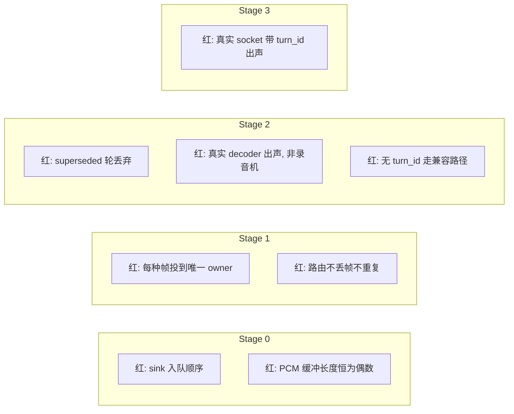

# 04 — 从测试出发

> 本节回答：整个重构由哪些测试驱动，以及我如何「先写红测试，再实现」。
> 纪律来源：`meta docs/40_研发流程与协作/78_会话交接与下一步` §五——**红验证的价值不在「测试会红」，而在「红的是不是你预料的那条」**。

> **修订（2026-09-20）**：本文是计划，**未按现状改写**。§1 那张「现有测试的命运」表里，判断基本兑现（旧测试随载体消失，意图迁到 coordinator / sink / decoder）；**唯一的偏差是「兼容路径」这条**，而且它出现了两次——§1 第一行预测「重构后应改为『无 `turn_id` 的帧走兼容路径』」，§2 的 T2c 把它写成了测试。这条兼容分支最终**没有被保留**：`legacyFrameWithoutTurnIDStillPlays` 对应的行为在 `d004869` 被反向执行成「无归属即丢弃」（`frameWithoutTurnIDIsDropped`）。原因不是它不重要，而是它想兼容的那个世界没有了——网关开始总是发 start，兼容路径不再是过渡期的桥，而是一条永远不会有帧走的路。

## 0. 为什么从这里出发

这套代码已经踩过一个「单测全绿、真机静音」的坑（`AppDependencies.swift:553-554`）。教训是：**静音这种失败模式，单测天然看不到**。所以测试策略要分两层：

1. **单元层**——锁住「播/丢」的**决策**（这是单测能测的），把决策从播放器里剥离出来。
2. **集成/真机层**——锁住「决策落地后真的出声」（这是单测测不到的，用真实 socket + 真机 smoke）。

现状测试已经揭示了系统「被当契约」的行为（见 01 §8），重构的第一步是**重新定义哪些契约值得保留、哪些契约正是要消灭的 bug**。

---

## 1. 现状测试已钉住的「契约」，逐条审视

| 现有测试 | 钉住的契约 | 重构后的命运 |
|---------|-----------|-------------|
| `testTTSDispatcher_IgnoresAudioBeforeStart` | `.idle` 漏帧 → `false` | **这条契约本身就是要消灭的 bug**。重构后应改为「无 turn_id 的帧走兼容路径」，测试语义改写 |
| `testTTSDispatcher_NewStartEndsAStuckDrainingStream` | 第二个出口防卡死 | 状态机消失后不再需要，但「废弃轮的迟到帧不吞下一轮」这个**意图**要迁移到 `TurnRegistry` 测试 |
| `testMockDecoder_RecordAllCalls` | Mock 记录 prepare/feed/finish | 随 Mock 删除 |
| `engineBackedDecoderPlaysInTheOrderItWasFed` | 播放顺序 = feed 顺序 | **保留意图**，迁移到 `AudioSink`/coordinator 的「顺序不变量」 |
| `engineBackedDecoderKeepsTurnsInOrder` | 轮间不交错 | **保留意图**，是 coordinator 的核心不变量 |
| `engineBackedDecoderRejectsACodecItCannotCarry` | 不支持 codec 提前失败 | 迁移到单一 `AudioFrameDecoder` |

**核心判断**：一半现有测试钉住的是「事故」，不是「设计」。重构不是删掉它们，而是**把意图（顺序、轮不交错、codec 失败）从被钉错的载体（dispatcher/mock）迁到对的载体（coordinator/sink/decoder）**。

---

## 2. 驱动重构的红测试清单（按 Stage）



### 最重要的三条「红」

**① `superseded` 轮丢弃（T2a）** —— 这是 P0-11 的根因修复，是整个重构存在的意义。

```swift
@Test func coordinatorDropsFramesOfASupersededTurn() async {
    let sink = RecordingSink()
    let c = TTSPlaybackCoordinator(decoder: PassthroughDecoder(), sink: sink)

    await c.onStart(turnID: "T1", voice: .opus)
    await c.onAudio(TurnKeyedAudioFrame(turnID: "T1", sequence: 0, payload: Data([0x01])))
    await c.onInterrupt(turnID: "T1")                 // 用户打断
    await c.onAudio(TurnKeyedAudioFrame(turnID: "T1", sequence: 5, payload: Data([0x05]))) // 迟到帧

    #expect(await sink.playedSequenceNumbers == [0])   // 迟到帧被丢，不播
}
```

**② 真实 decoder、非录音机（T2b）** —— 这是 2026-09-12 静音事故的那根保险丝。它直接断言「被 start 认领的帧最终到达 sink 并带非空 PCM」，而不是「到达了一个只记录的 Mock」。

```swift
@Test func startClaimedAudioReachesTheSinkAsSound() async {
    let sink = RecordingSink()
    let c = TTSPlaybackCoordinator(decoder: PCM16Decoder(), sink: sink) // 真实解码
    await c.onStart(turnID: "T1", voice: .pcm16k)
    await c.onAudio(TurnKeyedAudioFrame(turnID: "T1", sequence: 0, payload: pcm16Bytes))
    #expect(await sink.receivedPCM.isEmpty == false)   // 出声，而非被 Mock 吞掉
}
```

> 这条测试在现状下**无法通过**——因为生产绑定 `MockTTSDecoder`，`ai.tts.start` 一旦出现，帧就被派发器认领进录音机。这正是我们要先让它「红」，再让它「绿」的那条。

**③ 无 `turn_id` 走兼容路径（T2c）** —— 保证过渡期不破坏今天的出声。

```swift
@Test func legacyFrameWithoutTurnIDStillPlays() async {
    let sink = RecordingSink()
    let c = TTSPlaybackCoordinator(decoder: PCM16Decoder(), sink: sink)
    await c.onAudio(TurnKeyedAudioFrame(turnID: nil, sequence: 0, payload: pcm16Bytes))
    #expect(await sink.playedLegacyCount == 1)   // 行为与今天 audioEngine.play 一致
}
```

---

## 3. 各 Stage 的测试草图

### 3.1 Stage 0 — `AudioSink` 抽象

```swift
@Test func engineAudioSinkEnqueuesInFeedOrder() { /* 顺序不变量，迁移自 engineBackedDecoderPlaysInTheOrderItWasFed */ }
@Test func engineAudioSinkRejectsOddSampleCount() { /* PCM16 偶数长度，迁移自 RawPCM16FrameDecoder 校验 */ }
```

### 3.2 Stage 1 — `TransportEventRouter`

```swift
@Test func routerDispatchesEveryControlFrameToExactlyOneOwner() {
    // 对 WSControlFrame 每种 case，断言恰好投给一个 owner，且不遗漏
}
@Test func routerDispatchesAudioFramesToPlaybackOwnerOnly() { /* 音频帧只进 coordinator，不再散落 middleware */ }
```

### 3.3 Stage 2 — `TTSPlaybackCoordinator`

```swift
@Test func coordinatorKeepsTurnsInOrder()      { /* 迁移自 engineBackedDecoderKeepsTurnsInOrder */ }
@Test func coordinatorResetsWatermarkPerTurn() { /* 修 P1-7：水位线按轮重置，不按整场 */ }
@Test func coordinatorReportsUnknownTurnPerPolicy() { /* TurnRegistry 兜底策略可配置 */ }
```

### 3.4 Stage 3 — 真实 socket 集成（补 P1-22）

现状台账 `P1-22` 指出「没有任何测试构造过真实 socket」。Stage 3 必须补上：

```swift
@Test func realSocketRoundTripCarriesTurnIDAndProducesSound() async throws {
    // 用本地 URLSessionWebSocketTask 对打一个 fake gateway，
    // 发 ai.tts.start + 带 turn_id 的二进制帧，断言 sink 收到 PCM。
    // 这是「出声」这条链路上唯一能自动化的集成层。
}
```

---

## 4. 测试分层总表

| 层 | 测什么 | 测不到什么 | 载体 |
|----|--------|-----------|------|
| 单元（coordinator + RecordingSink） | 播/丢**决策**、顺序、轮不交错、codec 失败 | 是否真的出声 | Swift Testing `@Test` |
| 集成（真实 socket fake gateway） | 帧解编码、turn_id 穿透、决策落地 | 音频硬件行为 | `@Test` + 本地 socket |
| 真机 smoke | 出声、打断不串音、首响提前 | ——（最终裁决） | 手动 runbook |

**红线**：任何「出声」相关结论，不得只凭单元层绿而宣称完成。单元层只能证明「决策正确」，真机 smoke 才能证明「决策落地后有声音」。这两者之间的鸿沟，就是 2026-09-12 静音事故的教训。

---

## 5. 红验证执行清单（照抄 meta 78 §五）

每写一条测试，按此顺序：

1. 写测试 → 跑 → **确认它红，且红在预期断言上**。
2. 实现 → 跑 → 确认它绿。
3. **破坏实现** → 跑 → 确认它重新红，且红的是这条测试（不是别的）。
4. 若红的是另一条、或没红 → **你对系统的理解有偏差，先修理解，再修代码。**

特别地，对于 T2b（真实 decoder 出声）：破坏实现时「把 decoder 换回 Mock」必须让这条测试红——如果它不红，说明你的「出声」断言根本没测到东西（重演 `meta 78` 里「断言了 503 却测不到守卫」的空洞测试）。
